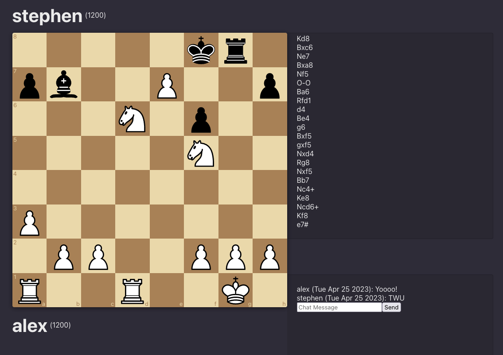

# Intro

This is a multi-player chess application built using chess.js, react-chessboard, and ws featuring chat, server-side move validation, opening book game-comments, and user login/registration.

# Development

`frontend/.env`

    PORT=3002
    REACT_APP_API_URL=http://localhost:3001/api
    REACT_APP_WS_URL=ws://localhost:8080
    ENV=dev

`backend/.env`

    PORT=3001
    WS_PORT=8080
    DB_HOST=127.0.0.1
    DB_USER=user
    DB_PASS=password
    DB_NAME=chess
    SF_BINARY=
    CERT_PATH=
    CERT_KEY=
    ENV=dev

For local developmenet, CERT_PATH and CERT_KEY can be left blank, but you'll need to install a command line version of stockfish and put the path for SF_BINARY. On Linux based machines this is typically /usr/games/stockfish

# Production
# Infrastructure

This application is deployed behind Cloudflare pointing to an AWS EC2 instance running Nginx for routing. The server is running a MySQL database, but if you plan to use this for production you should use a dedicated database service like RDS.

# Frontend

`cd frontend; npm run build; zip -r frontend.zip build`

Then move the zip file to your server, unzip and rename to `frontend`
Alternatively, setup a CI/CD pipeline like this repo has to do it for you.

`frontend/.env`

    PORT=3002
    REACT_APP_API_URL=https://chess-api.automic.io/api
    REACT_APP_WS_URL=wss://chess.automic.io:8443

`/etc/nginx/sites-enabled/chess`

    server {
        listen 80;
        server_name chesss.automic.io;

        root /home/admin/chess/frontend/build;
        index index.html;
        location / {
            try_files $uri $uri/ /index.html;
        }

        location /static/ {
            try_files $uri =404;
        }
    }

# Backend

Zip up the backend, send it to your server, and build it.

`/etc/systemd/system/chess-api.service`

    [Unit]
    Description=Chess API Service
    After=network.target

    [Service]
    Environment=PORT=3001
    Environment=WS_PORT=8443
    Environment=DB_HOST=localhost
    Environment=DB_USER=user
    Environment=DB_PASS=password
    Environment=DB_NAME=db
    Type=simple
    User=admin
    WorkingDirectory=/home/admin/chess/backend
    ExecStart=/usr/bin/npm run dev
    Restart=on-failure

    [Install]
    WantedBy=multi-user.target

## Note: 

Make sure you configure your correct environment variables in the service file 

IMPORTANT: The backend secure web-socket server relies on a ssl cert. You can use LetsEncrypt to generate these, or generate self-signed ones yourself. I used a Cloudflare Edge Certificate for mine.

_YOU CAN NOT CONNECT TO A WSS SERVER FROM A HTTP WEBSITE (localhost). Both connections have to be secure._

For production, you should run this service as www-root and change the permissions of the folder to be owned by www-root using `chown -R www-root:www-root /home/admin/chess/backend`

# Database

Database setup is simple, just download and install MySQL server on your server and import the db.sql file in the database folder.

# Todo
* ☑️ ~~Piece promotion~~
* ☑️ ~~Global state, Redux?~~
* ☑️ ~~Login / Register redirect to home-page~~
* ☑️ ~~Logout redirect to login~~
* ☑️ ~~ELO calculation on checkmate~~
* ☑️ ~~ELO Update on checkmate~~
* ☑️ ~~checkmate handling~~
* ☑️ ~~Chat reset bug~~
* ☑️ ~~Fix game history display~~
* ☑️ ~~Enter to send chat message~~
* ☑️ ~~Chess engine?~~
* ☑️ ~~Remove /api/users/users endpoint~~
* ☑️ ~~/login returns 404 error from link on register~~
* ☑️ ~~Play against bot~~
* ☑️ ~~Game history~~
* ☑️ ~~Chess board mobile responsive~~
* ☑️ ~~Game-over UI~~
* ⬜️ Fix game over score animation
* ⬜️ Login / Register page styling
* ⬜️ Piece promotion select
* ⬜️ Repetition handling
* ⬜️ Resign handling
* ⬜️ Threefold-reptition handling
* ⬜️ Stalemate handling
* ⬜️ Insufficient material handling
* ⬜️ Reconnection on socket drop
* ⬜️ Valid username regex
* ⬜️ Player profiles
* ⬜️ Find games
* ⬜️ Openings quiz
* ⬜️ Previous move highlights
* ⬜️ Matchmaking
* ⬜️ Game score
* ⬜️ Redesign game screen
* ⬜️ Redesign login screen
* ⬜️ Redesign register screen
* ⬜️ Redesign home screen
* ⬜️ 404 page
* ⬜️ Admin controls
* ⬜️ Report player
* ⬜️ Themes
* ⬜️ Stockfish clustering
* ⬜️ Session validation
* ⬜️ In check warning
* ⬜️ Resign against bot crashes server due to undefined socket, add check
* ⬜️ Figure out bot difficulty for ELO
* ⬜️ Refactor socket.ts