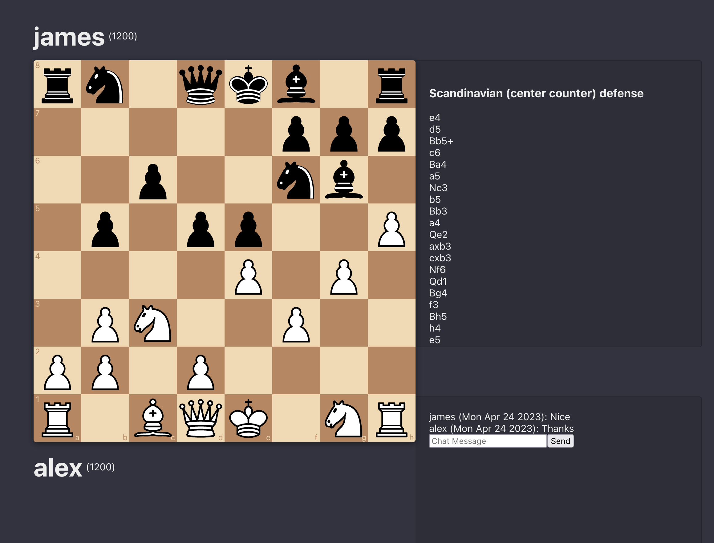

# Intro

This is a multi-player chess application built using chess.js, react-chessboard, and ws featuring chat, server-side move validation, opening book game-comments, and user login/registration.

# Infrastructure

This application is deployed behind Cloudflare pointing to an AWS EC2 instance running Nginx for routing. The server is running a MySQL database, but if you plan to use this for production you should use a dedicated database service like RDS.

# Frontend

`cd frontend; npm run build; zip -r frontend.zip build`

Then move the zip file to your server, unzip and rename to `frontend`
Alternatively, setup a CI/CD pipeline like this repo has to do it for you.

`frontend/.env`

    PORT=3002
    REACT_APP_API_URL=https://chess-api.automic.io/api
    REACT_APP_WS_URL=wss://chess.automic.io:8443

`/etc/nginx/sites-enabled/chess`

    server {
        listen 80;
        server_name chesss.automic.io;

        root /home/admin/chess/frontend/build;
        index index.html;
        location / {
            try_files $uri $uri/ /index.html;
        }

        location /static/ {
            try_files $uri =404;
        }
    }

# Backend

Zip up the backend, send it to your server, and build it.

`/etc/systemd/system/chess-api.service`

    [Unit]
    Description=Chess API Service
    After=network.target

    [Service]
    Environment=PORT=3001
    Environment=WS_PORT=8443
    Environment=DB_HOST=localhost
    Environment=DB_USER=user
    Environment=DB_PASS=password
    Environment=DB_NAME=db
    Type=simple
    User=admin
    WorkingDirectory=/home/admin/chess/backend
    ExecStart=/usr/bin/npm run dev
    Restart=on-failure

    [Install]
    WantedBy=multi-user.target

## Note: 

Make sure you configure your correct environment variables in the service file 

IMPORTANT: The backend secure web-socket server relies on a ssl cert. You can use LetsEncrypt to generate these, or generate self-signed ones yourself. I used a Cloudflare Edge Certificate for mine.

_YOU CAN NOT CONNECT TO A WSS SERVER FROM A HTTP WEBSITE (localhost). Both connections have to be secure._

For production, you should run this service as www-root and change the permissions of the folder to be owned by www-root using `chown -R www-root:www-root /home/admin/chess/backend`

# Database

Database setup is simple, just download and install MySQL server on your server and import the db.sql file in the database folder.

# Todo
* Login / Register redirect to home-page
* Logout redirect to login
* Login / Register page styling
* ELO calculation on checkmate
* ELO Update on checkmate
* checkmate handling
* Repition handling
* Reconnection on socket drop
* Valid username regex
* Player profiles
* Find games
* Openings quiz
* Chat reset bug
* Previous move highlights
* Matchmaking
* Game score
* Fix game history display
* Enter to send chat message
* Admin controls
* Report player
* Chess engine?
